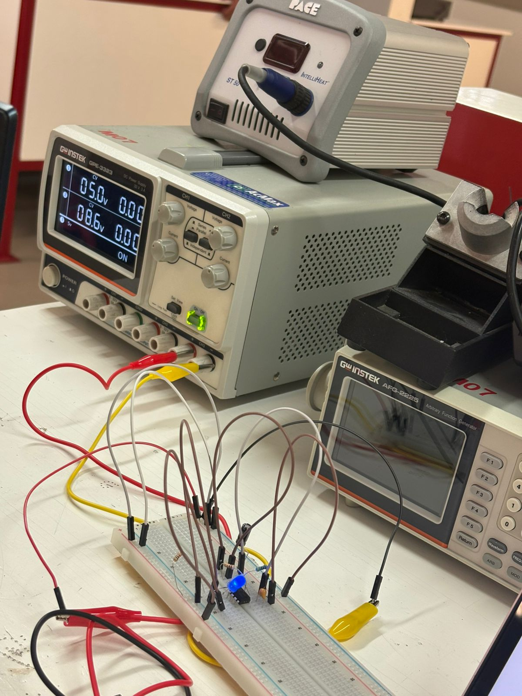
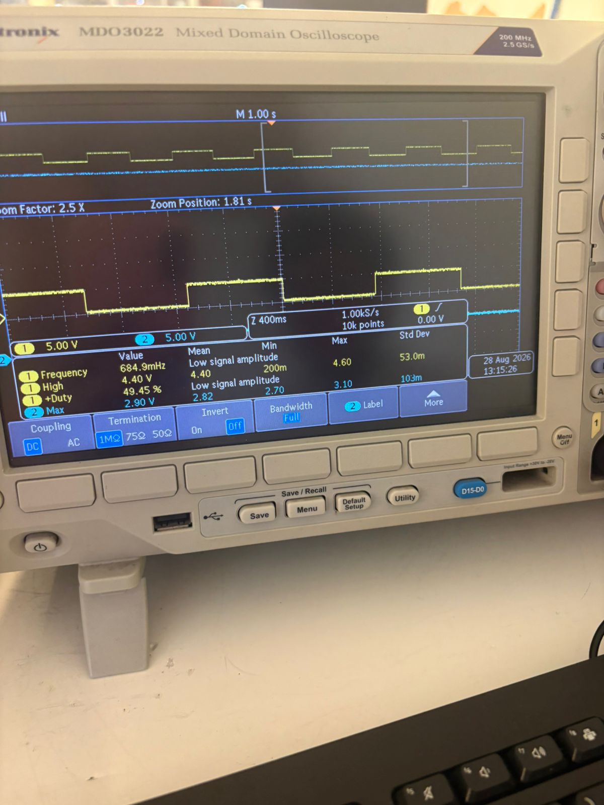
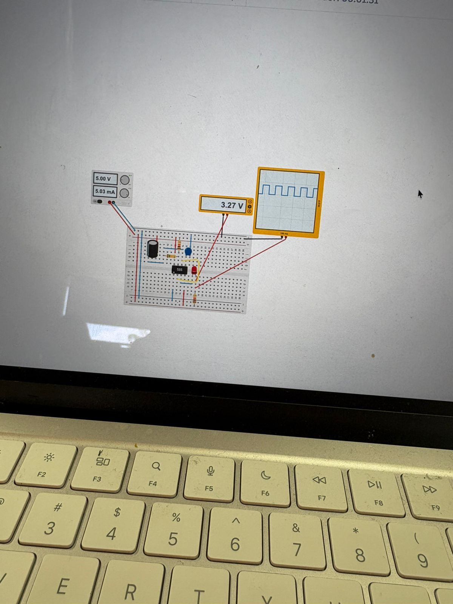
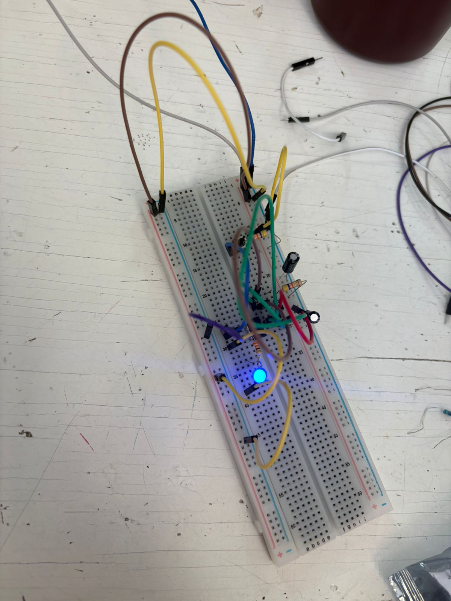

# Reporte de Práctica: Circuito Temporizador 555 en Modo Astable

**Institución:** Universidad Iberoamericana Puebla  
**Materia:** Introducción a la Mecatrónica  
**Tema:** Electrónica Básica / Osciladores RC con CI 555  

---

## 1. Objetivos

* **General:** Construir y analizar un circuito oscilador astable utilizando el circuito integrado NE555 para generar un parpadeo de LED a frecuencia controlada.
* **Específicos:**
  1. Calcular teóricamente la frecuencia ($f$), ciclo de trabajo (*Duty Cycle*), tiempos en alto/bajo y voltajes de salida.
  2. Implementar el montaje práctico en *protoboard* con los componentes seleccionados.
  3. Medir experimentalmente los parámetros del circuito utilizando un multímetro digital y un osciloscopio.
  4. Comparar los valores teóricos contra los medidos, determinando el porcentaje de error absoluto y justificando las diferencias.
  5. Identificar y solucionar fallas de medición técnica durante el laboratorio (Bitácora de errores).

---

## 2. Lista de Materiales y Componentes

| Cantidad | Componente / Equipo | Descripción / Valor |
| :--- | :--- | :--- |
| 1× | Circuito Integrado | NE555 (Encapsulado DIP-8) |
| 1× | LED | Diodo emisor de luz estándar (Color Rojo/Verde) |
| 1× | Resistor de carga LED | $R_{LED} = 330\,\Omega$ |
| 2× | Resistores temporizadores | $R_A = 1\,\text{k}\Omega$, $R_B = 10\,\text{k}\Omega$ |
| 1× | Capacitor de temporización | $C = 100\,\mu\text{F}$ (Electrolítico) |
| 1× | Capacitor de desacoplo | $C_{CTRL} = 10\,\text{nF}$ (Cerámico, conectado al Pin 5) |
| 1× | Fuente de Poder | Fuente DC regulada a $5.0\,\text{V}$ |
| 1× | Instrumentación | Multímetro digital y Osciloscopio con puntas de prueba |
| — | Auxiliares | Protoboard y cables de conexión (*jumpers*) |

---

## 3. Desarrollo Teórico y Fórmulas de Diseño

El temporizador 555 en configuración **astable** no posee un estado estable; conmuta continuamente entre el estado ALTO y BAJO. La carga del capacitor $C$ se realiza a través de $(R_A + R_B)$, mientras que la descarga ocurre exclusivamente a través de $R_B$.

### Fórmulas Generales
1. **Tiempo en ALTO ($t_{ALTO}$):**
   $$t_{ALTO} = 0.693 \cdot (R_A + R_B) \cdot C$$

2. **Tiempo en BAJO ($t_{BAJO}$):**
   $$t_{BAJO} = 0.693 \cdot R_B \cdot C$$

3. **Periodo Total ($T$):**
   $$T = t_{ALTO} + t_{BAJO} = 0.693 \cdot (R_A + 2R_B) \cdot C$$

4. **Frecuencia de Oscilación ($f$):**
   $$f = \frac{1}{T} = \frac{1.44}{(R_A + 2R_B) \cdot C}$$

5. **Ciclo de Trabajo (*Duty Cycle*):**
   $$\text{Duty (\%)} = \left( \frac{R_A + R_B}{R_A + 2R_B} \right) \times 100\%$$

---

### Sustitución y Cálculos Teóricos

Dado:  
$R_A = 1\,\text{k}\Omega = 1,000\,\Omega$  
$R_B = 10\,\text{k}\Omega = 10,000\,\Omega$  
$C = 100\,\mu\text{F} = 100 \times 10^{-6}\,\text{F}$  
$V_{CC} = 5.0\,\text{V}$

1. **Frecuencia Teórica ($f$):**
   $$f = \frac{1.44}{(1000 + 20000) \times (100 \times 10^{-6})} = \frac{1.44}{21000 \times 10^{-4}} = \frac{1.44}{2.1} \approx 0.6857\,\text{Hz} \approx 0.69\,\text{Hz}$$

2. **Ciclo de Trabajo Teórico ($\text{Duty}$):**
   $$\text{Duty} = \frac{1000 + 10000}{1000 + 20000} = \frac{11000}{21000} = \frac{11}{21} \approx 52.38\% \approx 52.4\%$$

3. **Voltaje de Salida en ALTO ($V_{OH}$):**  
   Para la tecnología BJT interna del 555 estándar, la caída interna de transistor es de aprox. $1.5\,\text{V}$:
   $$V_{OH\_teórico} = V_{CC} - 1.5\,\text{V} = 5.0\,\text{V} - 1.5\,\text{V} = 3.5\,\text{V}$$

4. **Corriente del LED ($I_{LED}$):**  
   Asumiendo un diodo LED con voltaje en directo $V_f \approx 2.0\,\text{V}$:
   $$I_{LED\_teórico} = \frac{V_{OH} - V_f}{R_{LED}} = \frac{3.5\,\text{V} - 2.0\,\text{V}}{330\,\Omega} = \frac{1.5\,\text{V}}{330\,\Omega} \approx 4.54\,\text{mA}$$

---

## 4. Tabla Comparativa: Datos Teóricos vs. Medidos

El porcentaje de error se calcula mediante la fórmula:
$$\%\,\text{Error} = \left| \frac{\text{Valor Medido} - \text{Valor Teórico}}{\text{Valor Teórico}} \right| \times 100\%$$

| Magnitud | Teórico Calculado | Medido Experimental | Porcentaje de Error (%) | Instrumento de Medición |
| :--- | :---: | :---: | :---: | :---: |
| **$V_{CC}$ (V)** | $5.00\,\text{V}$ | $5.051\,\text{V}$ | **$1.02\%$** | Multímetro |
| **$V_{salida\_alto}$ (V)** | $3.50\,\text{V}$ | $2.90\,\text{V}$ | **$17.14\%$** | Multímetro |
| **Frecuencia ($f$)** | $0.686\,\text{Hz}$ ($0.69\,\text{Hz}$) | $0.684\,\text{Hz}$ | **$0.29\%$** | Osciloscopio |
| **Ciclo de Trabajo (Duty)** | $52.38\%$ ($52.4\%$) | $50.68\%$ | **$3.25\%$** | Osciloscopio |
| **Corriente LED ($I_{LED}$)** | $\frac{V_{out} - V_f}{330} \approx 4.54\,\text{mA}$ | *(Medición directa)* | *—* | Multímetro |

---

## 5. Explicación de las Diferencias (Teórico vs. Medido)

1. **Frecuencia y Duty Cycle:** Presentaron márgenes de error insignificantes ($<3.5\%$). Las mínimas discrepancias se deben a la **tolerancia comercial de los componentes** (los capacitores electrolíticos suelen presentar diferencias del $\pm 10\%$ a $\pm 20\%$ respecto a su valor nominal, y las resistencias un $\pm 5\%$).
2. **Voltaje de Salida en ALTO ($V_{salida\_alto}$):** Se observó un error del $17.14\%$ ($2.9\,\text{V}$ frente a $3.5\,\text{V}$). Esto ocurre porque la caída interna de tensión de las etapas de salida del NE555 varía según la corriente consumida por la carga (en este caso el LED conectado al Pin 3). Al drenar corriente hacia el LED, la caída interna de los transistores NPN/PNP de la etapa de potencia aumenta, reduciendo la tensión disponible en el nodo de salida.

---

## 6. Bitácora de Errores

En el desarrollo práctico de los circuitos electrónicos es habitual enfrentarse a problemas técnicos de medición o montaje. A continuación se documenta la incidencia observada en el laboratorio:

* **a. ¿Qué falló?**  
  Al momento de visualizar la señal de salida en la pantalla del osciloscopio, no se observaba una onda cuadrada limpia. En su lugar, aparecían únicamente **picos/impulsos deformados** (*spikes*) en las transiciones de carga y descarga, imposibilitando la lectura correcta de la frecuencia y el ciclo de trabajo.
* **b. ¿Cómo se encontró el problema?**  
  Se realizó la inspección visual del trazo en pantalla junto con la verificación de los puntos de prueba (*probes*). Al notar que la forma de onda no correspondía con el comportamiento esperado del circuito astable y que la señal oscilaba de manera errática al mover la sonda, se identificó que la punta de prueba del osciloscopio estaba mal ubicada.
* **c. ¿Cómo se resolvió?**  
  Se corrigió la posición del terminal positivo de la sonda del osciloscopio (conectándolo directamente al **Pin 3 de salida del NE555**) y asegurando que la **pinza de tierra (GND)** estuviera firmemente conectada a la referencia común del circuito de la protoboard. Tras este reacomodo y el ajuste del escalamiento horizontal/vertical (Time/Div y Volts/Div), la onda cuadrada se desplegó de forma estable y correcta en pantalla.

---

## 7. Conclusiones

* Se comprobó experimentalmente el funcionamiento del temporizador NE555 en modo astable, logrando la oscilación continua y el parpadeo del LED a una frecuencia aproximada de $0.68\,\text{Hz}$.
* La correlación entre la teoría matemática y los datos medidos en osciloscopio fue alta, obteniendo desviaciones menores al $3.5\%$ en frecuencia y ciclo de trabajo.
* El análisis de la bitácora de errores permitió afianzar el criterio técnico sobre la correcta colocación de las sondas de osciloscopio y la importancia del punto de referencia a tierra (GND) para obtener lecturas configuradas.

* Se ocupó IA para darle formato a la práctica
## 8. Entregables Adjuntos (Checklist del Portafolio)

- [x] **Esquemático anotado:** Diagrama del circuito con valores de $R_A, R_B, C$ explícitos.
- [x] **Fotos del montaje:** Evidencia fotográfica de la implementación en protoboard.
- [x] **Tabla de medición vs. teoría:** Completada con \% de error e interpretaciones.
- [x] **Mini-video ($\le 60\text{ s}$):** Grabación mostrando la onda en el osciloscopio y parpadeo del LED con voz en off.
- [x] **Bitácora de errores:** Sección 6 del presente reporte.
- [x] **Imagenes:** Sección 7 del presente reporte.

{loading=lazy}
{loading=lazy}
{loading=lazy}
<video width="320" height="240" controls>
  <source src="video.mp4" type="video/mp4">
</video>

# Práctica EXTRA: Generación de Pulso Fijo (555 Monoestable)

## 📋 Lista de Entregables

- [x] **Fotos del montaje:** Evidencia fotográfica de la implementación en protoboard.
- [x] **Tabla de medición vs. teoría:** Completada con % de error e interpretaciones.
- [x] **Mini-video ($\le 60\text{ s}$):** Grabación mostrando la onda en el osciloscopio y el comportamiento del LED con voz en off.
- [x] **Bitácora de errores:** Sección 4 del presente reporte.

---

## 1. 📐 Fundamento Teórico

En la configuración **monoestable**, el temporizador 555 genera un único pulso de salida de duración fija ($T$) cuando recibe un pulso de disparo negativo **(Trigger)**.

La duración del pulso depende exclusivamente del tiempo de carga del capacitor $C$ a través de la resistencia $R_A$:

$$T = 1.1 \cdot R_A \cdot C$$

---

### 2 Montaje en Protoboard
{loading=lazy}

---

## 3. 📊 Tabla de Medición vs. Teoría

| Parámetro | Valor Teórico | Valor Medido | Error Relativo (%) |
| :--- | :---: | :---: | :---: |
| **Tiempo de Pulso ($T$)** | $5.164\text{ s}$ | $5.400\text{ s}$ | $4.57\%$ |

*Fórmula de Porcentaje de Error:*

$$\% \text{ Error} = \left| \frac{\text{Valor Medido} - \text{Valor Teórico}}{\text{Valor Teórico}} \right| \times 100$$

$$\% \text{ Error} = \left| \frac{5.400 - 5.164}{5.164} \right| \times 100 \approx 4.57\%$$

### Explicación de las Diferencias (Margen de Error)
* **Precisión en la toma del tiempo:** La medición del tiempo real se realizó con un cronómetro y también analizando el video grabado de la práctica, por lo que no es $100\%$ precisa.
* **Error humano (error de dedo):** Al medir manualmente el tiempo desde el video (iniciar y detener el cronómetro), existe un margen de imprecisión atribuible al tiempo de reacción o "error de dedo" al hacer clic.
* **Tolerancia de componentes:** Las variaciones naturales en los valores reales de la resistencia y del capacitor respecto a sus valores nominales también influyen en la pequeña diferencia observada.

---
## 4. 🛠️ Bitácora de Errores

* **¿Qué falló?:**  
  Al presionar el botón de disparo al principio, el LED/pulso en la salida se apagaba de forma casi inmediata, lo cual no nos dejaba observar el retardo deseado. Esto ocurrió porque inicialmente utilizamos una resistencia muy baja ($R_A = 1\text{ k}\Omega$), produciendo un pulso extremadamente corto e imperceptible:
  
  $$T = 1.1 \cdot (1000\ \Omega) \cdot (10\ \mu\text{F}) \approx 0.011\text{ s} \quad (11\text{ ms, imperceptible visualmente})$$

* **¿Cómo lo encontramos?:**  
  Verificamos las conexiones físicas del circuito con el diagrama e identificamos que la configuración del temporizador estaba bien armada. Al no ver el resultado esperado, consultamos con el profesor (Osorio), quien afortunadamente se encontraba en el salón y nos ayudó observando el circuito. Nos explicó que debíamos aumentar el valor de la resistencia $R_A$ para ampliar la constante de tiempo $RC$.

* **¿Cómo lo resolvimos?:**  
  Sustituimos la resistencia de $1\text{ k}\Omega$ por una de $47\text{ k}\Omega$. Al elevar la resistencia, el tiempo de pulso aumentó a aproximadamente $0.5\text{ s}$, logrando un intervalo claramente visible desde que se soltaba el pulsador hasta que el LED se apagaba.

---
## 5. Video

<video width="320" height="240" controls>
  <source src="videomono.mp4" type="video/mp4">
</video>

<video width="320" height="240" controls>
  <source src="videomal.mp4" type="video/mp4">
</video>

> **Nota 1:** El primer video es de cuando nuestro circuito seguía "erróneo" (no estaba mal conectado pero el valor de las resistencias hacia que nuestros cambios fueran inmediatos y por lo tanto imposibles de percibir a simple vista).
> **Nota 2:** Mis videos por alguna razón no se reproducen bien, ya hemos intentado arreglar el problema pero persiste.

## 5.1 Explicación Videos

En este video mostramos la implementación del temporizador 555 en modo monoestable, cuya función es generar un pulso de duración fija al recibir un disparo manual.

Al principio probamos con $R_A = 1\text{ k}\Omega$, pero el pulso duraba milisegundos y no se apreciaba. Corregimos aumentando la resistencia a $47\text{ k}\Omega$, lo que hizo visible el retardo.

---
## 6. 📝 Conclusión

En esta práctica se comprobó exitosamente el funcionamiento del temporizador 555 en configuración monoestable para la generación de un pulso de duración fija mediante la activación por un botón. Se evidenció cómo la constante de tiempo dependerá directamente de los valores del circuito $RC$, ya que al corregir el valor de la resistencia de $1\text{ k}\Omega$ a $47\text{ k}\Omega$ el retardo pasó de ser imperceptible a tener un intervalo claramente visible. Asimismo, el porcentaje de error de $4.57\%$ entre el valor teórico ($5.164\text{ s}$) y el medido ($5.4\text{ s}$) demostró ser completamente aceptable, respaldando la utilidad de este circuito en aplicaciones reales de retardos y filtrado antirrebote por hardware.

