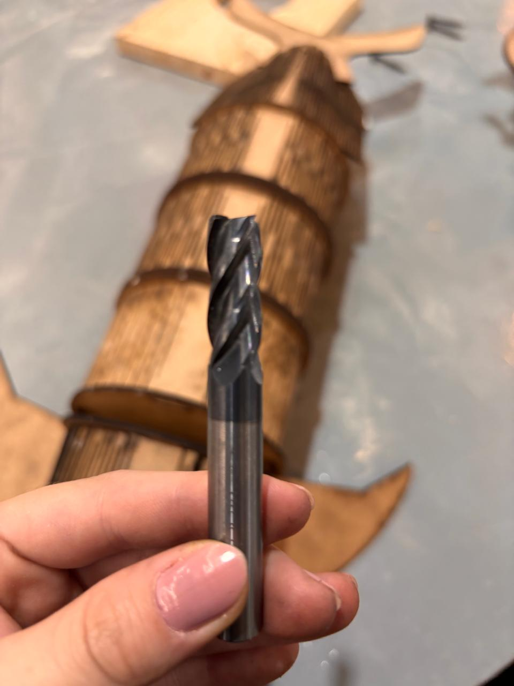
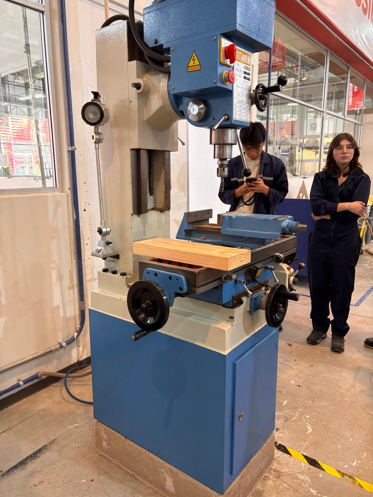
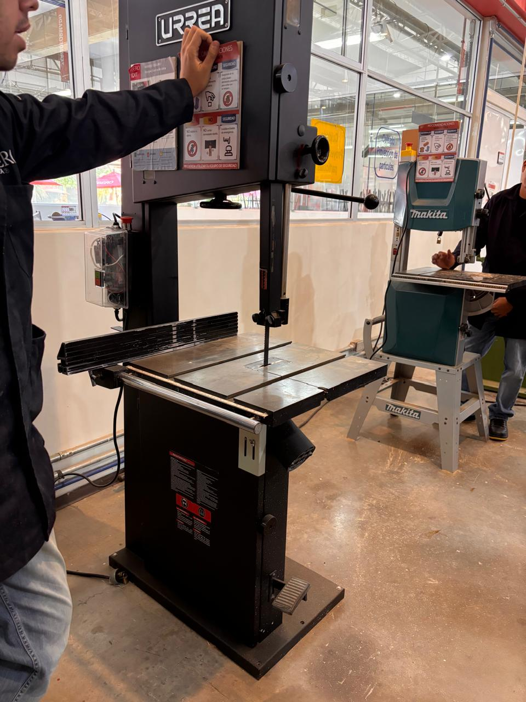
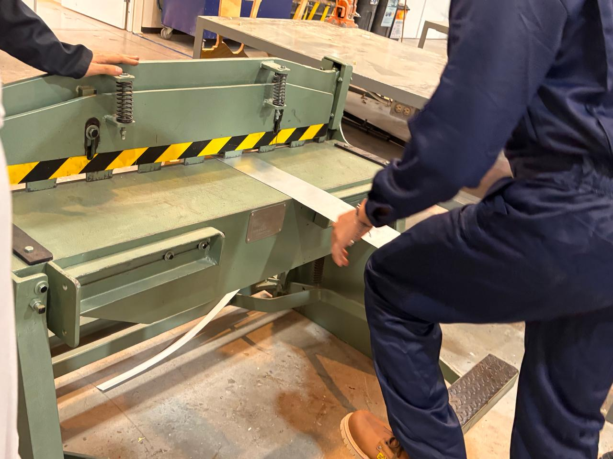
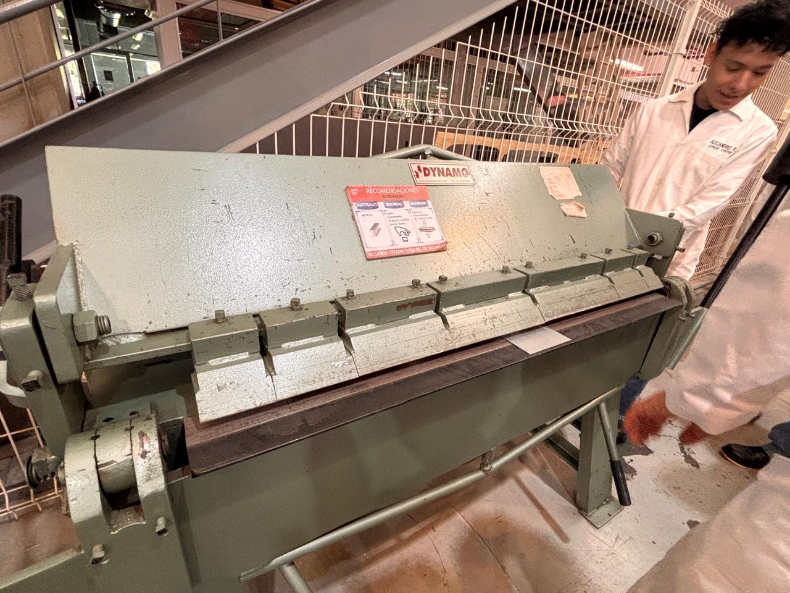
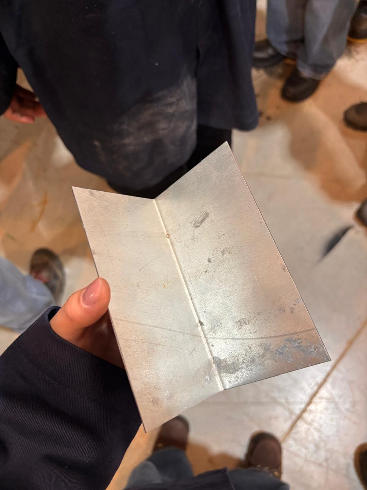

# Reporte de Práctica: Maquinaria, Herramientas e Instrumentos de Medición

**Institución:** Universidad Iberoamericana Puebla  
**Materiaa:** Proyectos de Ingeniería  

---

## 1. Reglas de Seguridad

El trabajo dentro de los talleres del IDIT exigen el cumplimiento estricto de las normas de seguridad e higiene para prevenir accidentes operativos y garantizar un entorno de trabajo controlado.

### Equipo de Protección Personal:
* **Bata de laboratorio u overol:** De uso obligatorio y debidamente abotonados para evitar atrapamientos en partes móviles de las máquinas.
* **Botas con casquillo:** Indispensables para la protección de las extremidades inferiores ante la caída accidental de piezas pesadas, láminas metálicas o herramientas.
* **Lentes de seguridad:** De uso obligatorio al operar o estar cerca de maquinaria de corte y maquinado (como la fresadora o la sierra cinta) para proteger los ojos de la proyección de virutas, astillas o partículas incandescentes.

---

## 2. Instrumentos de Medición

Durante la sesión impartida por el profe Oliver, se revisaron detalladamente herramientas de medición de alta precisión utilizadas en ingeniería, comparando instrumentos analógicos y digitales.

### 2.1. Vernier
El vernier es una herramienta versátil que permite tomar tres lecturas fundamentales:
1. **Medición exterior:** Se efectúa mediante la parte inferior para determinar diámetros o grosores externos.
2. **Medición interior:** Se realiza con las orejetas superiores para medir diámetros internos, aberturas o ranuras.
3. **Medición de profundidad:** Se ejecuta mediante la varilla  extensible del extremo posterior.

**Uso del Vernier:**  
Para usar el vernier  primero buscas qué número marca la regla principal y luego observas qué rayita de la parte deslizante se alinea perfectamente con una rayita de la regla fija. Por otro lado, con el vernier digital es mucho más sencillo: solo lees directamente el número que aparece en la pantalla y puedes cambiar entre milímetros y pulgadas presionando un botón.
---

### 2.2. Micrómetro 
Ofrece una precisión superior a la del vernier, siendo ideal para medir espesores delgados y diámetros reducidos con alta fidelidad.

* **Micrómetro Mecánico:** La medición se determina sumando la escala graduada del tambor fijo con la división del tambor móvil.
* **Micrómetro Digital:** El modelo digital permite lecturas absolutas e incorpora la función `INC`. Al presionar el botón `INC`, la pantalla se establece en cero ($0.000\text{ mm}$) en cualquier posición, facilitando mediciones relativas, verificación de tolerancias y diferencias respecto a una pieza patrón.
---

### 2.3. Registro Experimental de Mediciones en Cubos de Prueba
Durante la práctica se tomaron lecturas dimensionales de 5 cubos de prueba (identificados como Cubos 3, 8, 10, 11 y 12(lo hice en equipo con Alejandro Cruz Ortiz)), evaluando el ancho ($X$), largo ($Y$) y alto ($Z$) mediante el uso consecutivo del micrómetro y del vernier.

#### Cubos de Prueba

| Identificador de Cubo | Ancho ($X$) - Micrómetro | Largo ($Y$) - Micrómetro | Alto ($Z$) - Micrómetro | Ancho ($X$) - Vernier | Largo ($Y$) - Vernier | Alto ($Z$) - Vernier |
| :--- | :---: | :---: | :---: | :---: | :---: | :---: |
| **Cubo 3** | $26.62\text{ mm}$ | $34.52\text{ mm}$ | $22.53\text{ mm}$ | $28.38\text{ mm}$ | $36.98\text{ mm}$ | $24.12\text{ mm}$ |
| **Cubo 8** | $29.79\text{ mm}$ | $43.45\text{ mm}$ | $29.87\text{ mm}$ | $31.51\text{ mm}$ | $45.14\text{ mm}$ | $32.55\text{ mm}$ |
| **Cubo 10** | $38.87\text{ mm}$ | $38.83\text{ mm}$ | *Excede capacidad* | $40.80\text{ mm}$ | $40.48\text{ mm}$ | $19.33\text{ mm}$ |
| **Cubo 11** | $31.27\text{ mm}$ | $27.16\text{ mm}$ | $28.46\text{ mm}$ | $33.00\text{ mm}$ | $28.80\text{ mm}$ | $30.24\text{ mm}$ |
| **Cubo 12** | $29.20\text{ mm}$ | $33.80\text{ mm}$ | $26.90\text{ mm}$ | $30.90\text{ mm}$ | $35.54\text{ mm}$ | $28.89\text{ mm}$ |

*Nota: Las dimensiones están expresadas en milímetros ($\text{mm}$) bajo el formato Ancho ($X$), Largo ($Y$) y Alto ($Z$). Las diferencias observadas entre las lecturas tomadas con el micrómetro y el vernier probablemente se deban a algún error de calibración previa en los instrumentos, o bien a variaciones en la fuerza ejercida al apretar o dejar floja la pieza con cada herramienta durante la toma de datos.*

#### Observaciones:
* **Límite de Rango:** Para la dimensión $Y$ del **Cubo 10**, la apertura del arco del micrómetro utilizado resultó insuficiente para abrazar la pieza, evidenciando una limitación en el rango de alcance del micrómetro frente a la versatilidad de apertura del vernier.

---

## 3. Maquinaria de Corte y Maquinado

### 3.1. Fresadora e Instrumentos de Corte

#### Diferencia entre Fresa y Broca:
* **Broca:** Diseñada únicamente para hacer hoyos (solo dirección vertical (perpendicular a la superficie)), realizando barrenos o perforaciones cilíndricas.
* **Fresa:** Diseñada con filos que le permiten cortar en dirección vertical y transversal ($X, Y$). Sirve para el desbaste, planeado, ranurado y perfilado de piezas.

{loading=lazy}

#### Reglas de Operación para Fresado:
1. **Regla de Contacto:** Al realizar un corte lateral o de desbaste, el material no debe abarcar más de la mitad del diámetro de la fresa ($\le D/2$). Exceder este límite sobrecarga los filos y puede lastimar o romper la herramienta.
2. **Ajuste de Velocidades según el Material:** La velocidad de giro ($RPM$) debe ajustarse según el tipo de material a trabajar (madera vs. metales blandos o duros).
3. **Control de Fricción y Temperatura:** Una velocidad inadecuada o un avance forzado generan fricción excesiva. Esto provoca un sobrecalentamiento drástico que llega a quemar tanto la herramienta de corte como la pieza de trabajo.
4. **Movimiento de la Mesa mediante Manivelas:** El posicionamiento preciso de la pieza se controla manualmente accionando las manivelas de los carros longitudinal ($X$), transversal ($Y$) y vertical ($Z$).

{loading=lazy}
---

### 3.2. Sierra Cinta
Esta máquina utiliza una hoja de sierra sin fin para efectuar cortes continuos rectos y curvos en madera.

{loading=lazy}

---

## 4. Deformación y Corte de Lámina Metálica

### 4.1. Guillotina para Lámina
Diseñada para realizar cortes rectos y limpios en láminas metálicas.

**Técnica Correcta y Seguridad en el Pedal:**  
La máquina funciona mediante una palanca de pedal. Para accionarla de forma segura, se debe aplicar fuerza **apoyando un solo pie**, manteniendo la otra pierna bien cimentada en el suelo. Jamás se debe subir con ambos pies al pedal, ya que se pierde el equilibrio, generando un grave riesgo de caída.

{loading=lazy}

---

### 4.2. Dobladora de Lámina
Utilizada para efectuar pliegues, pestañas y dobleces angulares en láminas metálicas. Funciona aplicando una fuerza uniforme hasta lograr plegar la lámina al ángulo deseado.

{loading=lazy}
{loading=lazy}
---

## 5. Soldadora por Puntos

Une dos láminas de metal superpuestas sin requerir material de aporte. Aplica presión mecánica concentrada a través de dos electrodos de cobre e introduce un pulso de corriente eléctrica de gran intensidad en una fracción de segundo, logrando la fusión local del metal (*punto de soldadura*).

---

## 6. Conclusión

La práctica reforzó de manera práctica los conceptos fundamentales del procesamiento de materiales y mediciones. La correcta interpretación de las lecturas en instrumentos de medición analógicos y digitales, el conocimiento de los límites operativos de las herramientas de corte, así como la estricta adherencia a las normas de seguridad (EPP y posturas seguras en guillotinas), garantizan una formación técnica sólida para el desarrollo seguro y eficiente de proyectos de ingeniería.