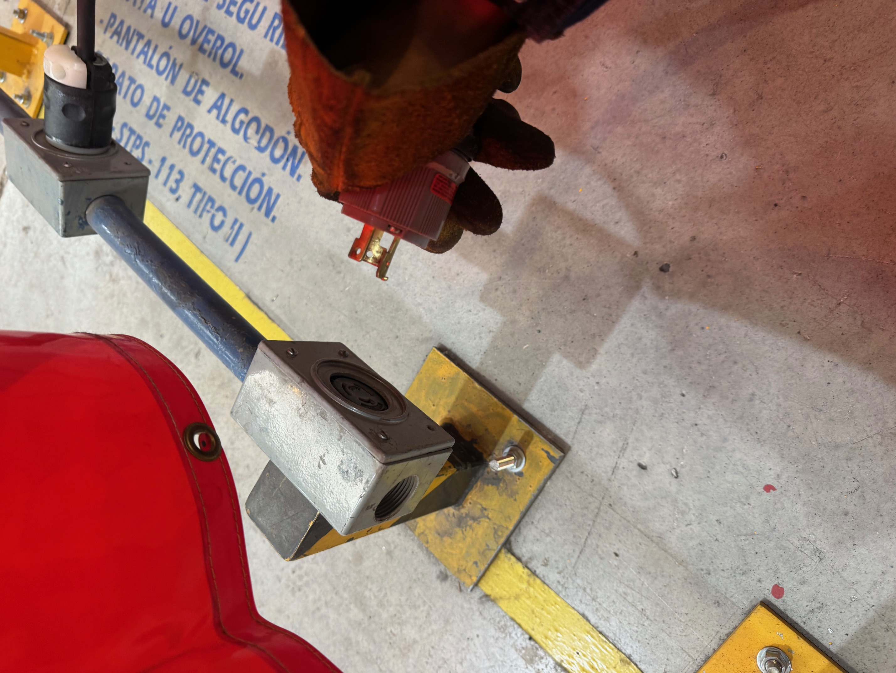
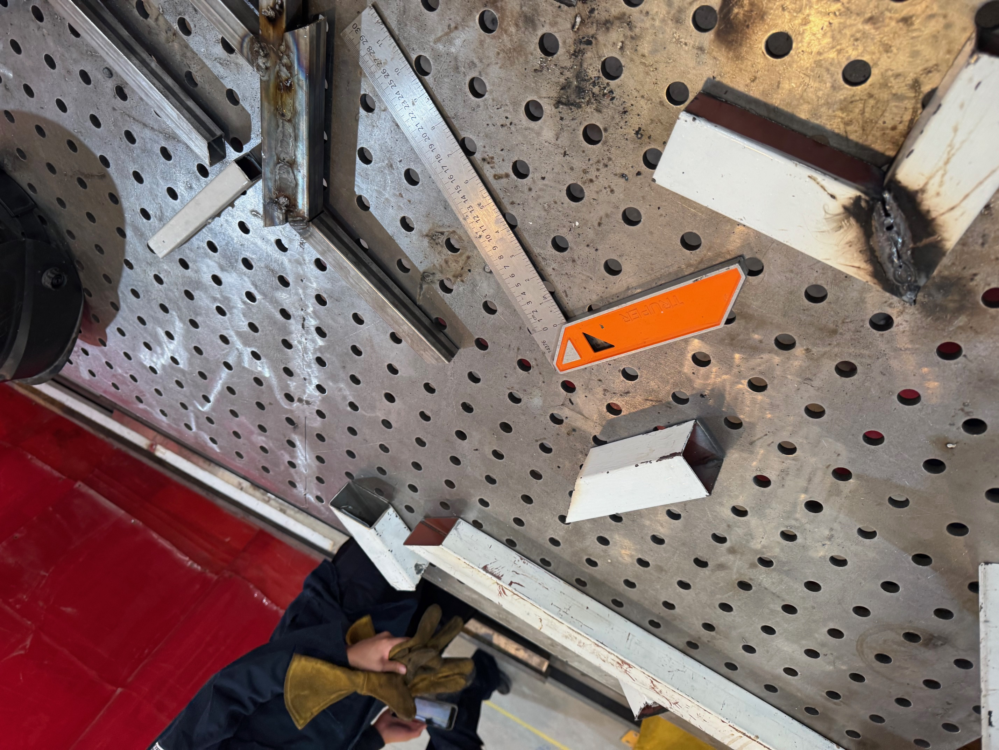
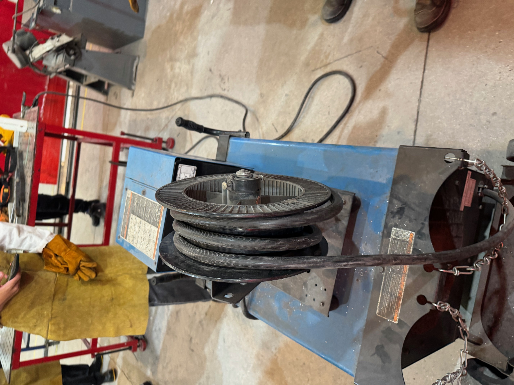

# Reporte: Práctica de Soldadura y Corte de Perfiles Metálicos

**Institución:** Universidad Iberoamericana Puebla  
**Materia:** Proyecto de Ingeniería I  

---

## 1. Normas de Seguridad y Equipo de Protección Personal

Antes de ocupar las herramientas y empezar el taller, revisamos las medidas de seguridad para prevenir accidentes y proteger nuestra integridad física. El equipo obligatorio consiste en:

- **Protección corporal:** Overol o bata, pechera de cuero y guantes de alto grosor para resguardarse de chispas y piezas calientes.
- **Protección para rostro y ojos:** Lentes de seguridad transparentes y careta para soldar que es necesaria para bloquear la luz intensa y la radiación UV.
- **Protección en extremidades:** Calzado de seguridad con casquillo de acero o cerámica para evitar golpes por la caída accidental de herramientas.
- **Seguridad general:** Mantener el cabello completamente recogido para evitar enganches con el material de trabajo o contacto con chispas.
- **Control de maquinaria:** Los equipos de mayor riesgo están asegurados con candado. El estudiante debe solicitar al personal encargado la apertura del equipo antes de utilizarlo.

---

## 2. Configuración del equipo y técnica de soldado

Los profesores a cargo (Profesores Oliver y Cholula) explicaron la manera correcta de conectar la pinza de tierra (para la mesa de trabajo) y el portaelectrodo (lo que agarra la varilla para soldar).

* **Instalación de cables:** Se identificó la conexión correcta de la pinza de tierra (fijada a la mesa metálica de trabajo) y la colocación del portaelectrodo que sostiene la varilla de soldadura.
* **Ajuste de parámetros eléctricos:**
  * *Voltaje ALTO:* El metal se funde demasiado rápido; entonces si no se utiliza la pinza con la velocidad adecuada, la pieza termina perforándose.
  * *Voltaje BAJO:* La varilla tiende a quedarse pegada a la pieza base.
  * *Criterio de ajuste:* Es necesario graduar la potencia de la máquina según el grosor del material y el tipo de trabajo a realizar.
* **Técnica de trabajo:**
  * Es obligatorio confirmar que todas las medidas de protección se estén siguiendo antes de prender el arco eléctrico.
  * El desplazamiento del electrodo debe mantenerse continuo y a una velocidad moderada (ni muy lento ni muy rápido).
  * Un alejamiento excesivo del electrodo impide que el material se adhiera correctamente; un avance muy rápido genera un cordón débil o descontinuo; quedarse fijo en un mismo punto provoca un hoyo en la estructura.

---

## 3. Operación de Herramientas de Corte

Observamos los tipos de cortadoras disponibles en el taller y la metodología para realizar cortes limpios y seguros:

1. **Equipos disponibles:**
   - Cortadora con disco dentado.
   - Cortadora con disco abrasivo (utiliza el desgaste por fricción para dividir la pieza).
2. **Procedimiento de corte:**
   - Asegurar firmemente la pieza metálica usando la prensa integrada en la base del equipo.
   - Hacer el corte en un solo movimiento fluido y continuo. > > Si la acción se interrumpe o se realiza en varias pasadas, la estructura del metal se altera y el borde suele quedar mal.
   - Conservar el equipo de protección puesto en todo momento debido a la proyección constante de chispas.

---

## 4. Acabado de Piezas

Al terminar los cortes, se quitaron los bordes irregulares y las rebabas sobrantes del metal:

- **Esmeril de banco:** Se utilizó para rebajar los sobrantes y nivelar las orillas de los perfiles cortados.
- **Lijado manual:** El profesor Cholula mostró cómo limpiar los bordes manualmente con lija para metal en caso de no disponer de un esmeril de banco.

---

## 5. Desarrollo de la Práctica

En la parte final del taller se aplicaron los conocimientos explicados:

1. Se sujetaron y cortaron tramos de perfiles metálicos siguiendo las instrucciones dads durante la práctica.
2. Después se pulieron y desbarbaron los extremos con esmeril y lija manual.
3. Por último se llevaron los perfiles preparados a la mesa de trabajo para realizar pruebas de unión mediante soldadura por arco eléctrico.

---

## 6. Registro Fotográfico y Anexos

{loading=lazy}
{loading=lazy}
{loading=lazy}

## 7. Conclusión
En esta práctica se comprendió la importancia de aplicar estrictamente el protocolo de seguridad antes de manipular herramientas de alto riesgo. Asimismo, se adquirió experiencia práctica en la calibración y técnica de soldadura por arco, el manejo correcto de cortadoras para obtener cortes limpios y el acabado final de piezas metálicas mediante esmerilado y lijado manual.